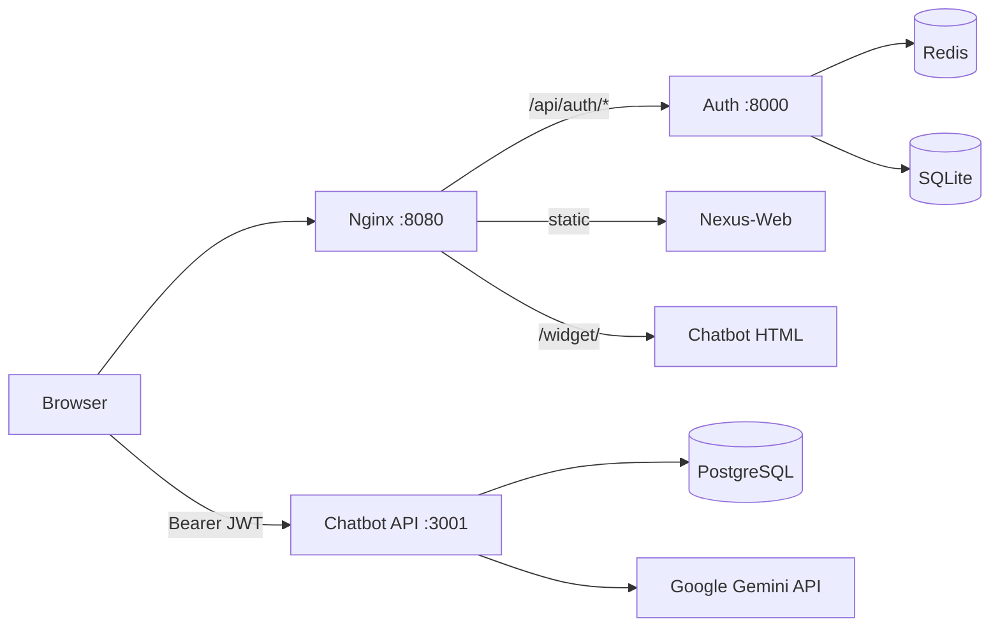

# Code Workspace

Integrated finance platform: **Nexus** landing + auth + AI portfolio assistant.

## Quick start (Docker)

```bash
cp .env.example .env
# Edit .env: set SECRET_KEY and GEMINI_API_KEY

docker compose up --build
```

| URL | Service |
|-----|---------|
| http://localhost:8080 | Nexus site (landing, login, dashboard) |
| http://localhost:8000/docs | Auth API (direct) |
| http://localhost:3001 | Chatbot API (direct) |

### Test flow

1. Open http://localhost:8080
2. Click **Get started** → register username **`alex`** (matches seeded Postgres portfolio)
3. After login, open the **Finance assistant** dashboard
4. Portfolio bar loads from PostgreSQL; chat uses Gemini (requires `GEMINI_API_KEY`)
5. **View live demo** on the landing page runs the widget in offline demo mode (`?demo=1`)

### Architecture



- **Auth-Server** signs JWTs with `SECRET_KEY`
- **Chatbot API** verifies the same secret as `JWT_SECRET` and maps `sub` (username) → Postgres user (`alex` → `alex@example.com`)
- **Nginx** proxies `/api/auth/*` and `/api/me` so the browser uses one origin for login

## Projects

| Folder | Role |
|--------|------|
| [Nexus-Web/](Nexus-Web/) | Landing (`nexus.html`), [login](Nexus-Web/login.html), [dashboard](Nexus-Web/app.html), [shared.js](Nexus-Web/shared.js) |
| [Auth-Server/](Auth-Server/) | FastAPI JWT auth (SQLite + Redis) |
| [Chatbot/](Chatbot/) | Express API + embeddable widget + [schema.sql](Chatbot/schema.sql) |

## Configuration

Root [`.env.example`](.env.example):

| Variable | Purpose |
|----------|---------|
| `SECRET_KEY` | Shared JWT secret (Auth + Chatbot) |
| `GEMINI_API_KEY` | Google Gemini API for `/api/chat` |
| `GEMINI_MODEL` | Gemini model id (default `gemini-2.0-flash`) |
| `POSTGRES_PASSWORD` | Postgres credentials (default `financedb`) |

## Running services individually

See project READMEs for standalone use:

- [Auth-Server/README.md](Auth-Server/README.md) — `uvicorn main:app --reload` (no standalone compose file; needs a local Redis)
- [Chatbot/README.md](Chatbot/README.md) — Node server + widget

## Security

- Do not commit `.env` files or API keys
- `Auth-Server/.env` is gitignored; use root `.env` for the integrated stack
- Demo widget: append `?demo=1` to skip auth (mock data only)
